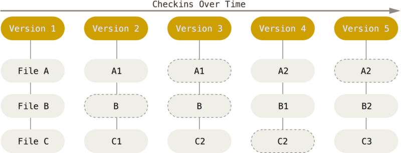

<!-- START doctoc generated TOC please keep comment here to allow auto update -->
<!-- DON'T EDIT THIS SECTION, INSTEAD RE-RUN doctoc TO UPDATE -->
**Table of Contents**  *generated with [DocToc](https://github.com/thlorenz/doctoc)*

- [Git是为了解决什么问题？](#git%E6%98%AF%E4%B8%BA%E4%BA%86%E8%A7%A3%E5%86%B3%E4%BB%80%E4%B9%88%E9%97%AE%E9%A2%98)
- [Git如何管理代码的修改历史](#git%E5%A6%82%E4%BD%95%E7%AE%A1%E7%90%86%E4%BB%A3%E7%A0%81%E7%9A%84%E4%BF%AE%E6%94%B9%E5%8E%86%E5%8F%B2)
  - [Git数据模型](#git%E6%95%B0%E6%8D%AE%E6%A8%A1%E5%9E%8B)
  - [三种状态](#%E4%B8%89%E7%A7%8D%E7%8A%B6%E6%80%81)
  - [远程仓库](#%E8%BF%9C%E7%A8%8B%E4%BB%93%E5%BA%93)

<!-- END doctoc generated TOC please keep comment here to allow auto update -->


# Git是为了解决什么问题？
git可以帮助我们**管理代码的修改历史**！

现代的版本控制系统可以帮助您轻松地（甚至自动地）回答以下问题：
- 当前模块是谁编写的？
- 这个文件的这一行是什么时候被编辑的？是谁作出的修改？修改原因是什么呢？
- 最近的1000个版本中，何时/为什么导致了单元测试失败？

版本控制系统 (VCSs) 是一类用于追踪源代码（或其他文件、文件夹）改动的工具。顾名思义，**这些工具可以帮助我们管理代码的修改历史**；不仅如此，它还可以让协作编码变得更方便。**VCS通过一系列的快照将某个文件夹及其内容保存了起来，每个快照都包含了文件或文件夹的完整状态。同时它还维护了快照创建者的信息以及每个快照的相关信息等等。**

为什么说版本控制系统非常有用？即使您只是一个人进行编程工作，它也可以帮您创建项目的快照，记录每个改动的目的、基于多分支并行开发等等。和别人协作开发时，它更是一个无价之宝，您可以看到别人对代码进行的修改，同时解决由于并行开发引起的冲突。

如果从git命令开始学习，可能会让人感到十分困惑，很多时候只能死记硬背一些命令，然后像魔法一样使用它们，一旦出现问题，就只能 delete the project and download a fresh copy。

# Git如何管理代码的修改历史
本质在于Git拥有一个精心设计的**数据模型，自下而上的学习Git**
## Git数据模型
Git对待数据更像是一个快照流：

>Fig: 存储项目随version改变的快照

Git 数据库中保存的信息都是以文件内容的哈希值来索引，而不是文件名

用伪代码写下Git的数据模型：
```go
// a file is a bunch of bytes
type blob = array<byte>

// a directory contains named files and directories
type tree = map<string, tree | blob>

// a commit has parents, metadata, and the top-level tree
type commit = struct {
    parents: array<commit>
    author: string
    message: string
    snapshot: tree
}
```
上面是一个干净简单的历史模型。  
对象和内容寻址：
"对象"可以是一个blob（文件中具体的字节），树（索引）或者是一个提交（commit）
```go
type object = blob | tree | commit
```
在 Git 数据存储中，所有对象都通过其`SHA-1` 哈希进行内容寻址。   
```go
objects = map<string, object>

def store(object):
    id = sha1(object)
    objects[id] = object

def load(id):
    return objects[id]
```
Blob、tree和commit的共同点：它们都是对象。而且当它们引用其他对象时，它们实际上并没有将被引用的对象包含在磁盘里，而是通过被引用对象的哈希来引用它们。

现在，所有快照都可以通过它们的 SHA-1 哈希来识别。这很不方便，因为人类不擅长记住 40 个十六进制字符的字符串。

Git 对这个问题的解决方案是 SHA-1 哈希的人类可读名称，称为“引用”。引用是提交的指针。与不可变的对象不同，引用是可变的（可以更新以指向新的提交）。

有了这个，Git 可以使用诸如“master”之类的人类可读的名称来引用历史中的特定快照，而不是长的十六进制字符串。master其实就是指针。

一个细节是，我们经常想要历史中“我们当前在哪里”的概念，这样当我们拍摄新快照时，我们就知道它是相对于什么的（我们如何设置`parents`提交的字段）。在 Git 中，“我们当前所在的位置”是一个特殊的引用，称为“HEAD”。

**在磁盘上，所有 Git 存储都是对象和引用：这就是 Git 数据模型的全部内容。通过添加对象和添加/更新引用，所有`git`命令都映射到提交 有向无环图的某些操作。**

**当输入任何命令时，要思考该命令对底层数据结构的操作。**
## 三种状态
你的文件可能处于其中之一：已修改（modified）、已暂存（staged）、已提交（committed）

- 已修改 表示修改了文件，但还没保存到数据库中。
- 已暂存 表示对一个已修改文件的当前版本做了标记，**使之包含在下次提交的快照中**。
- 已提交 表示数据已经安全地保存在本地数据库中。

这三种状态也就对应着Git项目拥有的三个阶段：工作区（working Directory）、暂存区（Staging Area）、Git目录（.git directory （Repository））  
- **工作区** 是对项目的某个版本独立提取出来的内容。 这些从 Git 仓库的压缩数据库中提取出来的文件，放在磁盘上供你使用或修改。  
- **暂存区** 是一个文件，保存了下次将要提交的文件列表信息，一般在 Git 仓库目录中。 按照 Git 的术语叫做“索引”，不过一般说法还是叫“暂存区”。  
- **Git 仓库目录** 是 Git 用来保存项目的元数据和对象数据库的地方。 这是 Git 中最重要的部分，从其它计算机克隆仓库时，复制的就是这里的数据。
## 远程仓库
> 远程仓库只是我们的本地仓库在另一台计算机上的拷贝，是一个强大的备份。其次就是远程可以让代码社交化，我们的项目被托管到别的地方，我们的朋友可以更加容易的为我们的项目做贡献。
>

git clone：在本地创建一个远程仓库的拷贝。

远程分支有一个特别的属性：在你检出远程分支时自动进入分离head状态。Git这么做是出于不能直接在这些分支上进行操作的原因，你必须在别的地方完成你的工作，（更新了远程分支之后）再用远程分享你的工作成果。

远程分支的命名规范：`<remote name>/<branch name>`, 例如：`origin/master`

如果看到一个名为origin/main的分支，那么这个分支就是main，远程仓库名称就是origin

head：head是对当前检出记录的符号引用，也就是指向你正在其基础上进行工作的commit版本

head总是指向当前分支上最近一次提交记录。大多数提交修改树的Git命令都是从改变head的指向开始的。

分离的head：分离的head就是让其指向了某个具体的提交记录而不是分支名。

`git branch -f main HEAD~3`